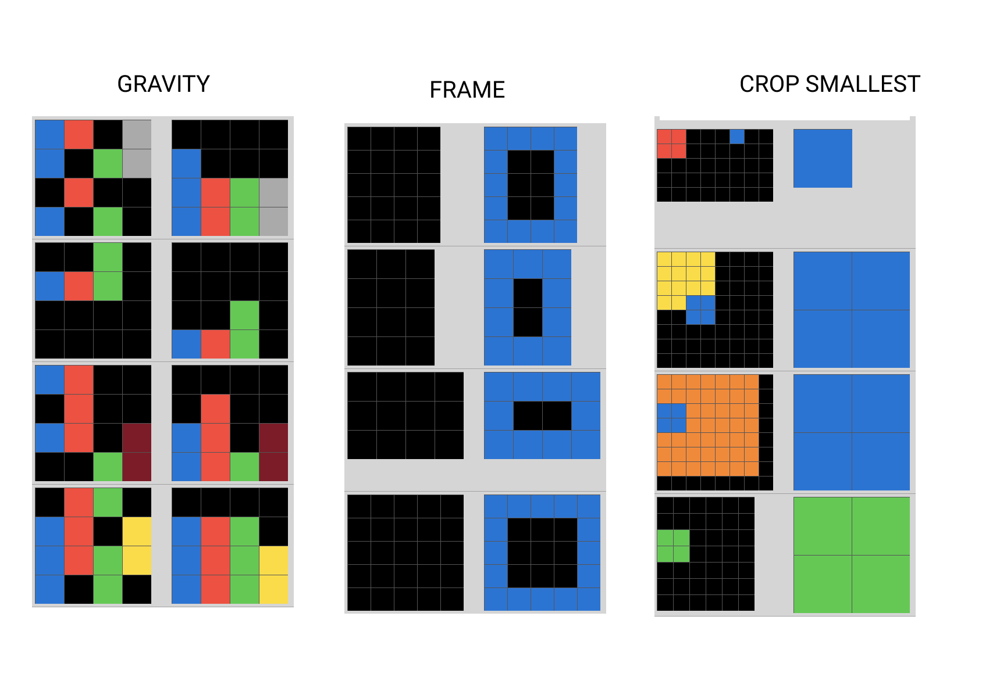

# Abstraction and Reasoning Challenge - Images Generator

[Abstraction and Reasoning Challenge - Kaggle](https://www.kaggle.com/c/abstraction-and-reasoning-challenge)

Shortly:
Abstraction and Reasoning Challenge - problem which requires only few, really easy for people, examples as training
data-set to solve a task.

Example:


## What does this program do?
Basicly, any algoritms used in Kaggle challenge didn't score any satisfying results. 
We wanted to check if increasing data set, creates better results.

This program is dataset generator for Kaggle's problem.

## How to use:
To use this this generator you have to:
1. Open [run.py file](run.py)
1. Comment/uncomment selected problem.
   ```python
   (...)
   # run_snake()
   run_labyrinth()
   ```
1. Set params in ``generate_and_save()`` function or leave default.
1. Run [run.py file](run.py). Now you've got created whole dataset.

## How to create new generator:
To create new generator, you have to:
1. Create new ProblemNameGenerator, which overwrites [GeneratorInterface](generator/generatorInteface.py), and create functions: ``generate_input()`` and ``generate_output()``
1. Create new ProblemNameVariationsGenerator, which overwrites [VariationsGeneratorInterface](generator/variationsgeneratorInteface.py), and create function: ``generate_all()``, which return array of ProblemGenerators. You have to iterate over all solutions yourself.
1. Create new function ``run_problemName()`` (similarly to previous functions) in  [run.py file](run.py) and run this function.
1. Wait until your new Problem dataset is generated. 

## How to visualise:
If you want to visualise created data, you can open [Testing Interface](visualizer/testing_interface.html). Press 'Choose file' button, and select file you want to see. 

There are example files to visualise:
- [Gravity](readme_files/0_grv.json) 
- [Crop Smallest](readme_files/3_cs.json)
- [Frame](readme_files/0_frm.json)

There is a visualization of mentioned above problems:


