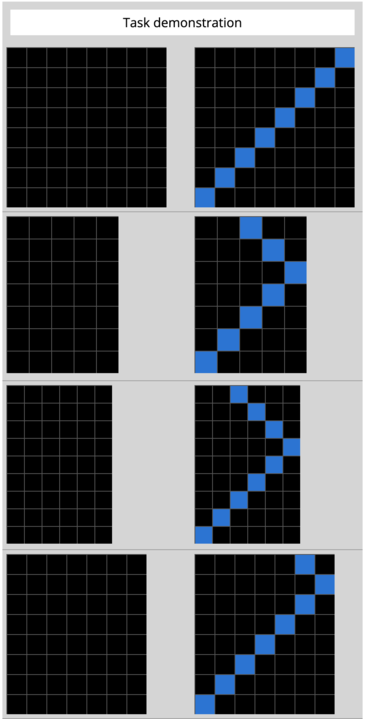

# Abstraction and Reasoning Challenge - Images Generator

[Abstraction and Reasoning Challenge - Kaggle](https://www.kaggle.com/c/abstraction-and-reasoning-challenge)

Shortly:
Abstraction and Reasoning Challenge - problem which requires only few, really easy for people, examples as training
data-set to solve a task.

Example:

## What does this program do?

## How to use
To use this this generator you have to:
1. Open [run.py file](run.py)
1. Comment/uncomment selected problem.
1. Set params or leave default
1. run [run.py file](run.py)

## How to create new generator

## How to visualise

## Example data

